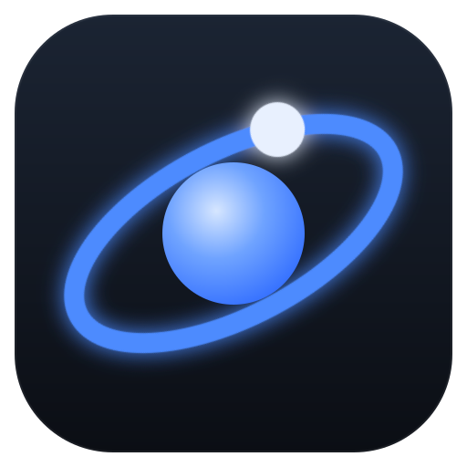
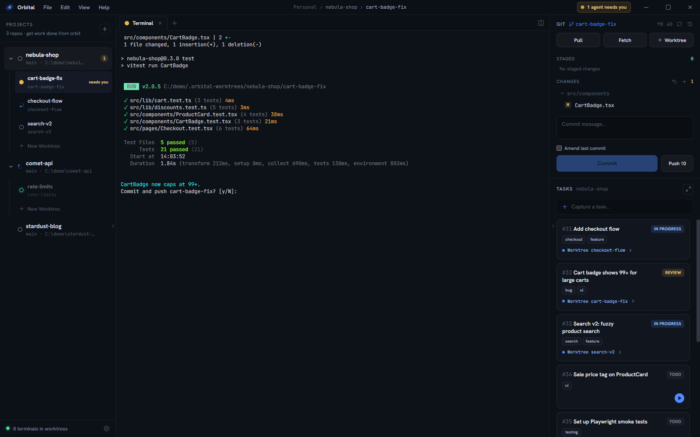
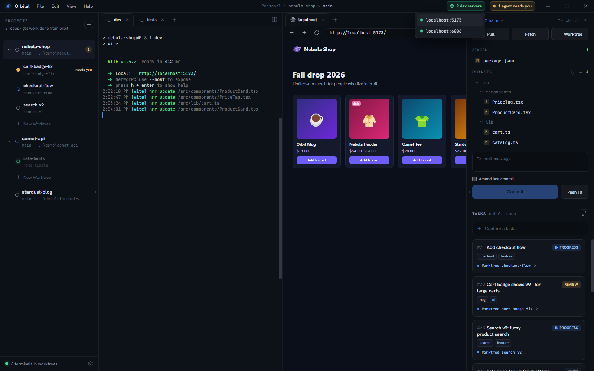
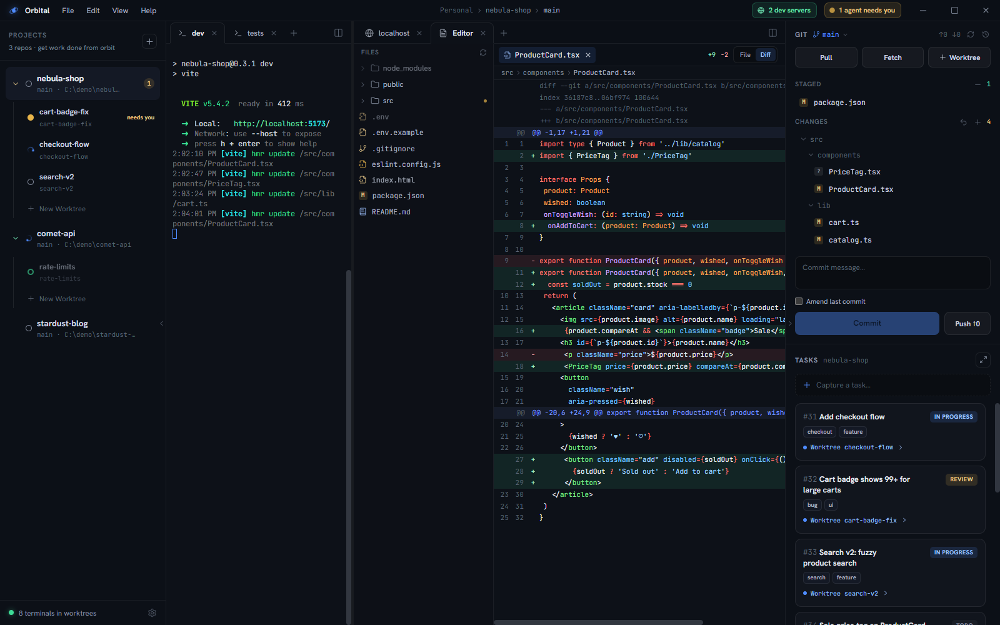

<p align="center">
  
</p>

<h1 align="center">Orbital</h1>

<p align="center"><strong>Get work done from orbit.</strong><br>
A native Windows cockpit for running many interactive coding agents side by side.</p>

<p align="center">
  <a href="https://jimbuck.github.io/orbital/">Website</a> ·
  <a href="https://github.com/jimbuck/orbital/releases/latest">Download</a> ·
  <a href="https://jimbuck.github.io/orbital/getting-started/quick-start/">Quick start</a> ·
  <a href="https://jimbuck.github.io/orbital/reference/cli/">CLI reference</a>
</p>

<p align="center">
  <a href="https://github.com/jimbuck/orbital/releases/latest"></a>
  
  
</p>

---

Orbital runs many interactive coding agents — Claude Code, Codex, or any CLI
tool — side by side. Every stream of work gets its own git worktree, its own
terminals, browser previews, and diff viewer, and a live status signal that
tells you exactly which agent needs you *right now*.

Agents are fast, but they block on you: permission prompts, questions, finished
work waiting for review. Run three of them in plain terminal windows and you're
the bottleneck, alt-tabbing around to find the one that stalled ten minutes ago.
Orbital turns that mess into a mission control: park each agent in its own
isolated **worktree**, glance at the rail to see who's `working` and who
`needs you`, answer the blocked one, and get back to what you were doing.

**Orbital never wraps or re-implements your agent.** It spawns the real
interactive CLI in a real terminal (ConPTY + xterm.js), so you keep the full
feature set of your preferred harness — slash commands, hooks, MCP servers,
permission modes, plan mode — and everything runs on your existing
subscription instead of metered API tokens. **Claude Code is fully supported
at launch; Codex support is planned.** The full product spec lives in
[`Orbital_PRD_v1.1.md`](./Orbital_PRD_v1.1.md).


## What you get

### Worktrees: one isolated working surface per stream of work
- Every project (a local git repo) starts with a **root worktree** on your main
  checkout, and can spawn **linked worktrees** — each is a real `git worktree`
  on its own branch, created in one click (with a base-ref picker), so agents
  never trample each other's changes.
- Your `.env` files (and any glob patterns you configure) are **synced into new
  worktrees automatically** and kept in sync while you work — checkouts are
  runnable immediately. The root checkout is the source of truth: a sync always
  **overwrites** the worktree copy, so edit synced files at the root, not in a
  linked worktree.
- Worktrees are laid out as **split panes**: drag a tab to any edge to split
  horizontally or vertically, drag dividers to resize, nest as deep as you like.
  Layouts persist across restarts.
- Right-click a worktree to rename it, close it (keeping it on disk), or delete
  the worktree — with a guard that refuses to silently discard unpushed work.

### Tabs: terminals, agents, browser, editor
- **Terminal** — a real PTY running your preferred shell, with WebGL rendering,
  clickable links, and proper multi-line paste (bracketed paste for TUIs).
- **Agent** — boots straight into your coding agent (per-project provider and
  executable path are configurable). If an agent exits, its tab cleans itself up.
- **Browser** — plain-click a URL in any terminal and it opens as an in-app
  preview tab next to your agent; Ctrl+click sends it to your system browser.
- **Editor** — a file tree with git-status badges, syntax-highlighted viewing,
  Markdown preview, staged/unstaged **diff views**, and light inline edits.
- Terminal scrollback survives tab switches and pane moves — the PTY lives in
  the main process, the UI just reattaches.

### Status: know who needs you without looking
Each terminal carries a status — `idle · working · needs-attention · error ·
done` — and every worktree and project rolls up the most urgent one. When an
agent flips to needs-attention you get a **three-way alert**: the rail badge
pulses, a title-bar banner appears, and the Windows taskbar icon gets a badge
(plus an optional chime). Each is individually toggleable in Settings.



Statuses update automatically two ways:

1. **Claude Code hooks** — install them once from Settings (Orbital shows you
   the exact JSON it will merge into `~/.claude/settings.json` before touching
   it, and can remove it just as cleanly). From then on every Claude session
   launched inside Orbital reports itself: working while it uses tools, needs
   attention on permission/idle prompts, idle when it stops. Typing into a
   blocked agent clears the alert instantly. See
   [`docs/claude-code-hooks.md`](./docs/claude-code-hooks.md).
2. **The `orbital` CLI** — any agent (or script) can set its own status
   explicitly; see below.

### Tasks: capture work, launch it as a worktree
- A lightweight per-project tracker: capture with one keystroke, edit titles
  inline, move through `todo → in progress → ready for review → done`.
- **Start a worktree from a task** — one click creates the branch + worktree +
  terminal, pre-linked so the task shows where its work lives.
- A **full board view** across all projects with drag-and-drop between both
  status columns and project lanes.
- Agents can file follow-up work themselves with `orbital task add`.


### The `orbital` CLI
Every worktree terminal has `orbital` on PATH, wired back to the app over a local
pipe — so agents can drive the cockpit:

```sh
orbital status <idle|working|needs-attention|error|done>   # set this terminal's status
orbital worktrees                                          # list worktrees in this project
orbital worktree new [--worktree <branch>] [name]          # spin up a new linked worktree
orbital tab new <terminal|browser|editor|agent> [arg]      # open a tab in this worktree
orbital task add "<title>" [--description <text>]          # capture a task
orbital task list [--all]                                  # open tasks (id, status, title)
orbital task update <id> --status <status>                 # progress a task (id prefix ok)
orbital task done <id>                                     # shorthand for --status done
orbital server add <url|port>                              # register a live dev server
orbital server remove <url|port>                           # deregister it
orbital server list                                        # this worktree's live servers
```

When a worktree has registered dev servers, the title bar shows a green
"N dev servers" pill and the add-tab menu lists each one — one click opens it
in an in-app browser tab next to your agent.



### Git, without leaving the cockpit
The right panel is a full working-tree surface for the active worktree: branch +
ahead/behind, stage/unstage individual files or everything, two-step-confirmed
discard (including discard-all), commit with **amend** (prefilled from HEAD),
push (sets upstream automatically), pull, fetch — and every changed file opens
as a proper diff. External changes (an agent committing in a terminal, a
checkout elsewhere) are picked up by filesystem watchers in root checkouts *and*
worktrees, so the panel is always current.



### Quality of life
- Frameless, keyboard-friendly dark UI designed for long sessions.
- Everything persists in SQLite under your user profile — never inside a repo.
- Right-click a project to remove it from Orbital (repo and worktrees stay on
  disk); hover any task card to delete it, with an inline confirm.
- Packaged builds **auto-update in the background** from GitHub releases; a
  quiet pill in the title bar tells you when a restart will finish the update.

## How to best use it

The workflow Orbital is built around:

1. **Add your repos** as projects (the **+** in the left rail).
2. **Install the Claude Code hooks** (Settings → Claude status hooks) so
   statuses take care of themselves.
3. **Capture tasks as they occur to you** — yours or your agents' — instead of
   interrupting what you're doing.
4. When you're ready to parallelize, **start a worktree from a task**: branch,
   worktree, env files, terminal — one click. Boot an agent tab and brief it.
5. **Work in the root worktree yourself** while linked worktrees grind away.
   The rail tells you the moment any of them needs input; answer, and go back.
6. **Land finished work from the git panel** — review the diff, stage, commit,
   push — then right-click the worktree, delete it, and mark the task
   done.

Three to five concurrent agents is the sweet spot: enough parallelism to keep
you busy purely with decisions and reviews, few enough that a needs-attention
chime always means something.

## Getting started

```sh
npm install        # installs deps; postinstall applies the node-pty patch (below)
npm run rebuild    # compile node-pty + better-sqlite3 against Electron's ABI
npm start          # build the CLI, then launch the app (electron-vite dev)
```

Then click **+** in the left rail, pick a local git repo, and you have a root
worktree with a live terminal. Run `claude` (or any agent) in it — or create an
**agent tab** and let Orbital boot it for you.

### Native build notes (Windows)

`node-pty` and `better-sqlite3` are native modules compiled for Electron's ABI.

- `npm run rebuild` runs `electron-rebuild` for both.
- A small patch (`patches/node-pty+1.1.0.patch`, applied automatically by the
  `postinstall` hook via `patch-package`) makes node-pty's bundled **winpty**
  build portable: it calls its helper `.bat` scripts with a `.\` prefix (so it
  works even when `NoDefaultCurrentDirectoryInExePath` is set) and disables the
  optional **Spectre-mitigated libraries** requirement (`MSB8040`), which is not
  installed by default with Visual Studio Build Tools.
- You need the **MSVC C++ build tools** and Python (the standard node-gyp
  prerequisites).

## Scripts

| Script | Purpose |
|--------|---------|
| `npm start` / `npm run dev` | build the CLI and launch the app in dev (HMR) |
| `npm run build` | production build of main/preload/renderer |
| `npm run make` | build + package a Windows installer (electron-builder) |
| `npm run rebuild` | recompile native modules for Electron |
| `npm run typecheck` | `tsc --noEmit` for node + web project references |
| `npm run lint` | ESLint |
| `npm run build:cli` | bundle the `orbital` CLI to `resources/cli/orbital.js` |

## Stack

Electron · electron-vite · React 18 · Tailwind v4 · TypeScript ·
node-pty (ConPTY) + xterm.js (WebGL) · better-sqlite3 · chokidar · zustand · Lucide.

## Releases & auto-update

Commits follow [Conventional Commits](https://www.conventionalcommits.org/)
(enforced by a commitlint hook). semantic-release turns them into versioned
GitHub releases automatically — no release PRs — publishing each release only
after the Windows installer is built and attached, and packaged builds
self-update from those releases in the background — see
[`docs/releasing.md`](./docs/releasing.md).

## Layout

```
src/
  shared/types.ts          Shared contract (domain types, IPC channels, CLI protocol)
  main/                    Electron main process
    index.ts               App lifecycle + frameless window
    ipc.ts                 IPC handlers + CLI control dispatcher
    runtime.ts             Service hub + renderer broadcasts
    db/                    better-sqlite3 schema + repositories
    services/              git · worktree · env-sync · terminals · control-channel · alerts · updater
  preload/index.ts         contextBridge -> window.orbital
  renderer/                React + Tailwind cockpit
  cli/orbital.ts           The `orbital` CLI (bundled to resources/cli)
design/                    The source design (cockpit + Tailwind guide) as HTML
```
