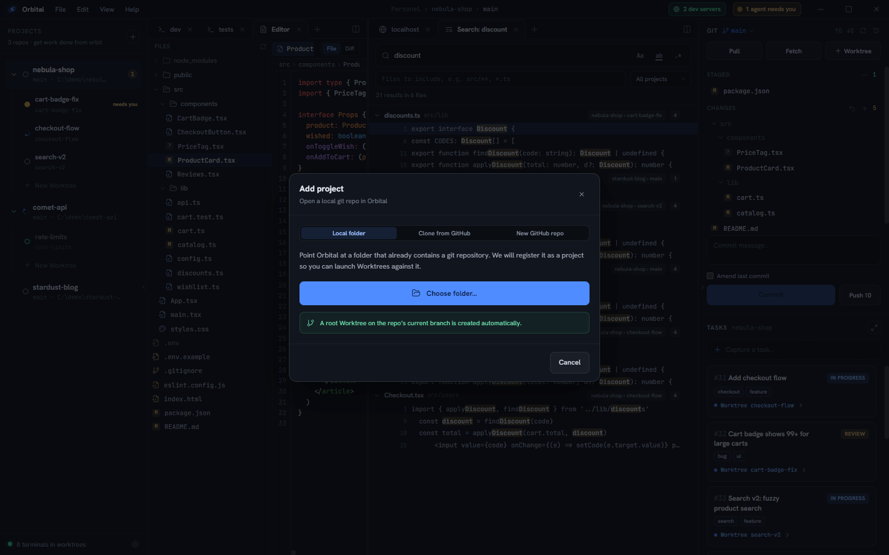
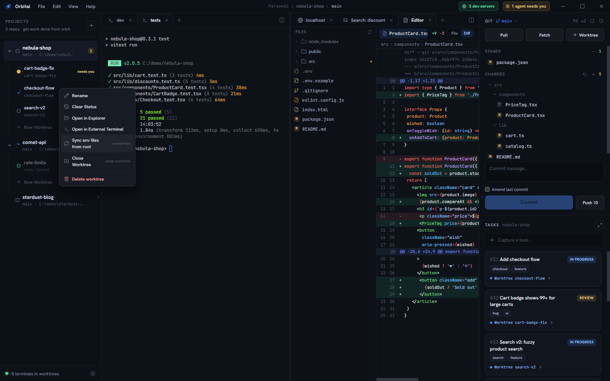

## Projects

A **project** is a local git repository opened in Orbital. The left rail lists
every project with an aggregate status dot and its worktrees. Add one with the
**+** button or **File ▸ Add Project…**; remove one from Orbital by
right-clicking its header (the repo and its worktrees stay on disk). Projects
belong to a [workspace](/orbital/concepts/workspaces/).

The **Add project** dialog has three sources:

- **Local folder** — pick a folder that is already a git repository.
- **Clone from GitHub** — pick one of your repositories (or type `owner/repo`)
  and clone it into a folder of your choosing.
- **New GitHub repo** — create a repository on GitHub and clone it in one go.
  The form mirrors `gh repo create`: owner (you or one of your organizations),
  a name with a live availability check, visibility, description, and under
  *More options* a README, `.gitignore` template, license, template repository,
  homepage, issues/wiki toggles and an org team.

The GitHub sources use the [GitHub CLI](https://cli.github.com) (`gh`), so it
needs to be installed and signed in with `gh auth login`. Cloning goes through
`gh repo clone`, which picks HTTPS or SSH from your `gh` configuration and
supplies credentials, so private repositories work without extra setup.

If `gh` is signed in to more than one account (a personal and a work login,
say), a **GitHub account** picker appears above the form. It defaults to gh's
active account, and choosing another one reloads the owners and repositories
as that login. Orbital acts as the chosen account for that dialog only, by
handing `gh` the account's token for each call, so it never runs
`gh auth switch` and your terminals keep whichever account they had.

## Worktrees

A **worktree** is a working surface bound to one working directory:

- The **root worktree** (`main` badge) is your normal checkout. Every project has
  exactly one, and it can't be removed.
- **Linked worktrees** are real `git worktree` checkouts on their own branch,
  created via **New Worktree** or from a task. They live in a
  sibling directory — for `C:\Projects\nebula-shop`, worktrees go under
  `C:\Projects\.orbital-worktrees\nebula-shop\<branch>` — so they never pollute
  the repo itself.

Orbital is a worktree *dashboard*, not just a worktree creator: every checkout
`git worktree list` reports shows up under the project automatically, wherever
it lives and however it was created. Run `git worktree add` in any terminal and
the new worktree appears in the rail within a second; remove one externally and
its entry (with its tabs and layout) goes away. Discovery runs at launch and
live, by watching each repo's `.git/worktrees` directory.

**New Worktree** (on the project row, **File ▸ New Worktree…**, or the ▶ on a
task) leads with the worktree's name and offers two choices:

- **Create a new branch.** The branch name follows the worktree name until you
  edit it, and forks from the base ref you pick.
- **Open an existing branch.** Local branches are checked out directly; a
  remote-only branch like `origin/pr-42` gets a local tracking branch. Handy for
  reviewing a pull request in its own worktree.

Branch names are slugified for you ("Login flow" → `login-flow`) and collisions
get numeric suffixes. If the branch already exists, Orbital attaches to it;
otherwise it forks a new branch from the base ref you chose (default `HEAD`).

Right-click a worktree for **Rename**, **Sync env files from root**,
**Open in Explorer**, **Open in External Terminal**, **Clear Status** (for a
status that got stuck), **Close Worktree** (keeps it on disk) and **Delete
worktree**. Deleting refuses to discard uncommitted or unpushed work unless you
explicitly force it, and the rail shows progress while a large worktree is
removed.

### Env-file copy

A new worktree gets the project's untracked env files copied in from the root
checkout: `.env` and `.env.*` at any depth, agent config directories like
`.claude/`, and `node_modules/`, which copies in the background while the rail
shows the worktree as setting up. Your feature branch runs straight away. The
patterns are configurable in **Settings ▸ Environment file sync**.

The copy happens once. After that the worktree's files are its own, so a
worktree can diverge from the root on purpose. When you do want the root's
current copies, right-click the worktree and choose **Sync env files from
root** (or run `orbital worktree sync` in one of its terminals). It asks first,
since it overwrites, and tells you how many files it copied.

## Panes & tabs

Each worktree owns a **split tree of panes**, each pane a strip of tabs:

- **Terminal** — a real PTY running your shell. Paste a clipboard image and
  Orbital saves it to a scratch file and pastes the path, so an agent can read
  your screenshot.
- **Agent** — a PTY that boots straight into one of the workspace's
  [agent profiles](/orbital/guides/running-agents/#agent-profiles).
- **Browser** — an in-app preview (plain-clicking a URL in any terminal opens
  one; Ctrl+click uses your system browser).
- **Editor** — file tree, open-file pills, syntax-highlighted source, diffs,
  previews, images. See [The editor](/orbital/guides/editor/).
- **Search** — content search across the checkout, the project or the whole
  workspace. See [Command palette & search](/orbital/guides/command-palette/).

Right-click a tab to rename, split, close it, or close the others. Closing a
terminal or agent tab whose process is still running asks first.

Drag a tab to another pane's strip to move it, or to a pane **edge** to split in
that direction. Drag the dividers to resize. A new worktree starts with one empty pane; pick
what to open from its **+** menu. Layouts, tabs, and worktrees all
persist across restarts — terminals restart fresh (scrollback intentionally does
not persist), while scrollback *does* survive tab switches within a session.
