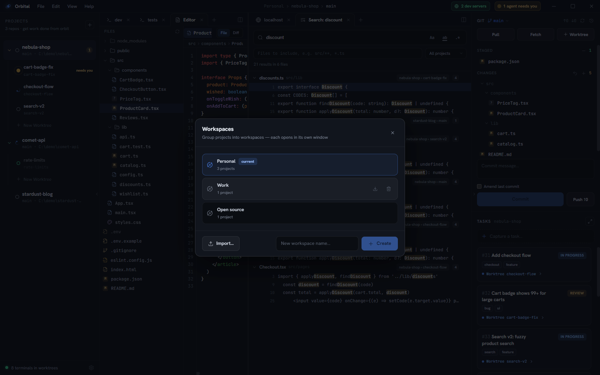

A **workspace** is a named set of projects that opens in its own Orbital
window. Most people start with one. A second one earns its place when two sets
of work should never mix: a *Personal* workspace with your side projects and a
*Work* workspace with the company repos, each launching agents against its own
Claude profile.



## What belongs to a workspace

Everything you configure lives on the workspace, so two windows can look and
behave differently:

- its projects, and through them their worktrees, tabs and tasks
- the theme and accent colour, so each window is recognisable at a glance
- agent profiles (a work Claude and a personal Claude, say), the default shell,
  alert toggles, env-file patterns, periodic fetch, zoom level and the default
  open action

Nothing in Settings is machine-wide any more. A workspace that has never set a
value picks up the one older builds stored globally, so upgrading doesn't
reset your look.

## Opening and switching

**File ▸ Workspaces…** lists every workspace, most recently opened first.

- Click one to open it in its own window. If it is already open, Orbital
  focuses that window instead of starting a second copy.
- Type a name into **New workspace name…** to create one.
- The download icon exports a workspace to YAML; the bin deletes it, along with
  its tasks. Repositories on disk are never touched.
- **Import…** reads an exported YAML file back in as a *new* workspace.

On Windows, right-click Orbital's taskbar icon for a **Recent** list of up to
seven workspaces. Picking one launches it straight into that workspace.

A launch with no arguments opens the workspace you used last. To pin one, pass
`--workspace-id <id>` (or set `ORBITAL_WORKSPACE_ID`).

## Telling windows apart

A workspace other than the default puts its name in the title bar breadcrumb
and the OS window title. Give each workspace a different **accent colour**
(Settings ▸ Workspace) and you can tell them apart from across the room.

## Sharing a workspace

The YAML export carries the project list and the workspace's settings, so a
teammate can import the same setup:

```yaml
# Orbital workspace export.
version: 1
id: 3f9c2a4e-8b1d-4c7a-9e21-5d6f0a7b8c90
name: Work
projects:
  - name: comet-api
    path: C:\Work\comet-api
  - name: nebula-shop
    path: C:\Work\nebula-shop
settings:
  theme: tokyo-night
  accentColor: "#7aa2f7"
  envSyncPatterns: [".env", ".env.*", ".claude/settings.local.json"]
```

Paths are absolute. If the repos live somewhere else on the importing machine,
edit the paths before importing. Import always creates a new workspace, so it
never overwrites one you already have.

## Under the hood

All workspaces share one SQLite database under your user profile
(`%APPDATA%\orbital\orbital.db`). Each window runs as its own process with its
own Chromium profile and its own control pipe, which is why an `orbital`
command always reaches the window its terminal belongs to.
