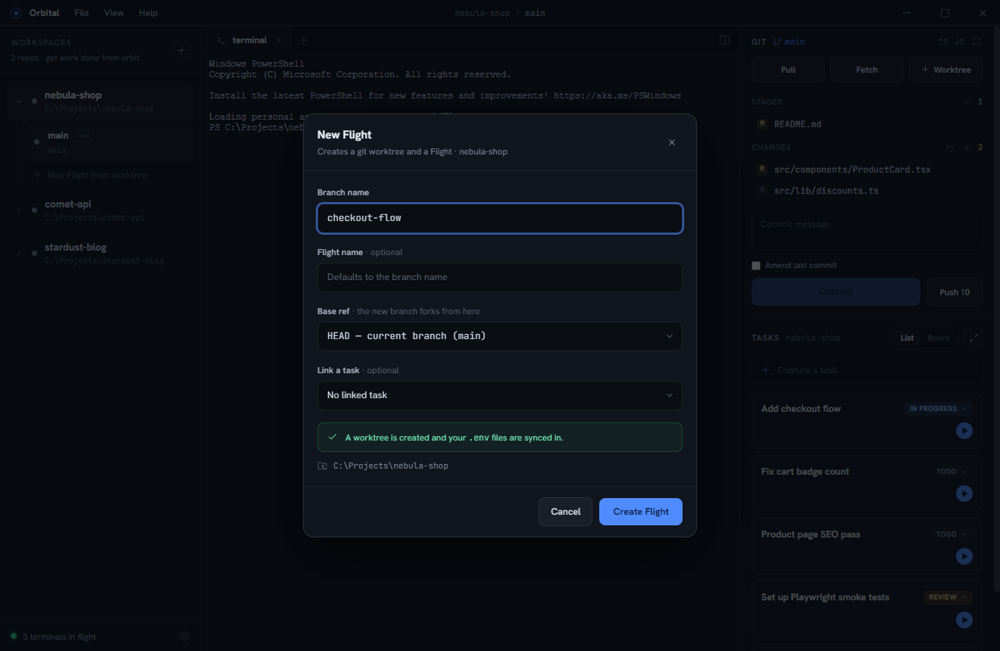
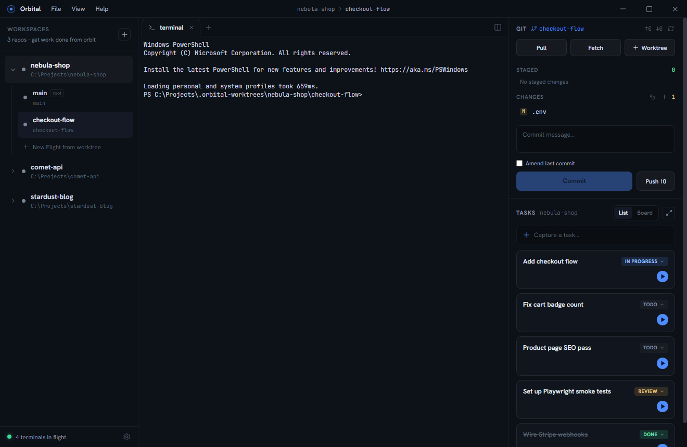

This walkthrough uses **nebula-shop**, an example storefront repo.

## 1. Add a workspace

Click the **+** at the top of the left rail and pick your repo's folder. The
repo appears as a workspace with a **root Flight** (`main`) bound to your normal
checkout — with a live terminal already running.

## 2. Capture some tasks

Type into **Capture a task…** in the right panel and press Enter. Tasks are
per-workspace and take one keystroke to file — capture first, triage later.

## 3. Start a Flight for parallel work

Click **New Flight from worktree** under the workspace (or press the ▶ button on
a task to pre-link it). Pick a branch name and, optionally, the base ref to fork
from.

Orbital creates a git worktree in a sibling `.orbital-worktrees` directory,
copies your `.env` files into it, and opens the Flight with a fresh terminal:

## 4. Run an agent

Run `claude` (or any agent CLI) in the Flight's terminal — or click **+** in the
tab strip and choose **Claude** to boot one directly.

## 5. Let statuses work for you

Install the Claude Code hooks once (**Settings → Claude status hooks**) and every
Claude session started inside Orbital reports itself automatically: *working*
while it uses tools, *needs attention* when it's blocked on you, *idle* when it
stops.

When an agent flips to needs-attention, the rail pulses, the title bar shows
**"1 agent needs you"**, the taskbar icon gets a badge, and (optionally) a chime
plays. Typing into the blocked agent clears the alert instantly.

## 6. Land the work

When a Flight is done: review the diff in the git panel, stage, commit, push —
then right-click the Flight and **Delete worktree**. Mark the task done. Orbit
achieved.
