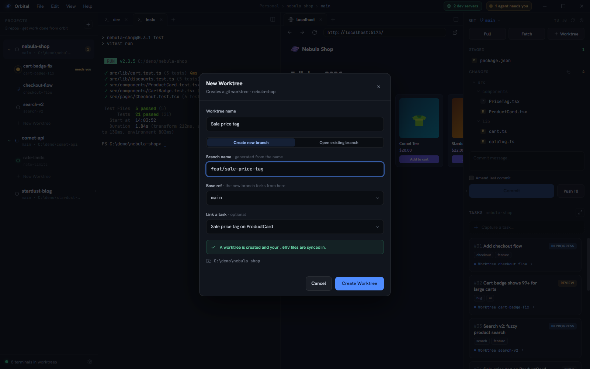
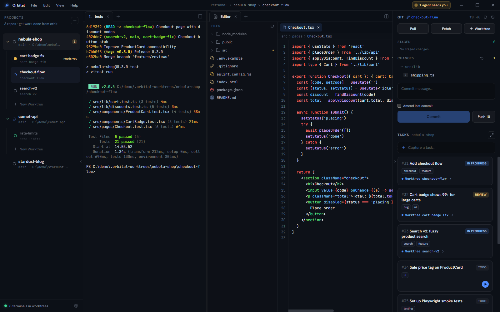

This walkthrough uses **nebula-shop**, an example storefront repo.

## 1. Add a project

Click the **+** at the top of the left rail (or **File ▸ Add Project…**) and
pick your repo's folder. With the GitHub CLI signed in, you can also clone one
of your GitHub repositories or create a new one from the same dialog. The repo
appears as a project with a **root worktree** (`main`) bound to your normal
checkout.

## 2. Capture some tasks

Type into **Capture a task…** in the right panel and press Enter. Tasks are
per-project and take one keystroke to file — capture first, triage later.

## 3. Start a worktree for parallel work

Click **New Worktree** under the project (or press the ▶ button on
a task to pre-link it). Name it, then either create a new branch (forked from
the base ref you pick) or open an existing one.

Orbital creates a git worktree in a sibling `.orbital-worktrees` directory,
copies your `.env` files and agent config into it, and opens it with an empty
pane. Use the pane's **+** menu to open a terminal, an agent, a browser or the
editor, and drag tabs to pane edges to split:

## 4. Run an agent

Run `claude` (or any agent CLI) in the worktree's terminal — or click **+** in the
tab strip and choose an agent profile (Claude, Codex or Cursor) to boot one
directly. Agent tabs resume their conversation after a restart.

## 5. Let statuses work for you

Install the Claude Code hooks once (**Settings ▸ Agents**, on your Claude
profile's card) and every Claude session started inside Orbital reports itself
automatically: *working*
while it uses tools, *needs attention* when it's blocked on you, *idle* when it
stops.

When an agent flips to needs-attention, the rail pulses, the title bar shows
**"1 agent needs you"**, the taskbar icon gets a badge, and (optionally) a chime
plays. Typing into the blocked agent clears the alert instantly.

## 6. Land the work

When a worktree is done: review the diff in the git panel, stage, commit, push —
then right-click the worktree and **Delete worktree**. Mark the task done. Orbit
achieved.

## Next

- Press **Ctrl+Shift+P** for the [command palette](/orbital/guides/command-palette/).
- Install [the orbital skill](/orbital/agents/skill/) so Claude sessions you
  start by hand know the cockpit too.
- Pick a theme and an accent in [Themes & appearance](/orbital/guides/appearance/).
