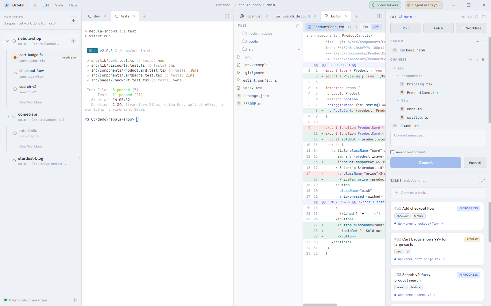

## Themes

Orbital ships twenty themes. There's Orbital's own dark and light pair, the
editor defaults (VS Code Dark+ and Light+, Darcula, IntelliJ Light, One Dark and
One Light, Monokai) and the community favourites (Dracula, Nord, Tokyo Night,
Catppuccin, GitHub, Gruvbox, Solarized).

A theme colours the whole window. The terminal's ANSI palette, the editor's
syntax highlighting and the markdown preview all follow it.

Three ways to switch:

- **Settings ▸ Appearance**, which shows the full gallery
- **View ▸ Theme**, with System and the two Orbital themes up front and the rest
  under **More Themes…**
- the command palette: type `theme`

**System** follows Windows' light/dark setting, and it's a pair: pick the theme
for a dark OS and the one for a light OS, say Dracula at night and GitHub Light
by day. Both default to the Orbital themes.

Themes apply as you click, so Cancel won't bring the old one back.

## Accent colour

Settings ▸ Workspace has an accent picker with eight presets, a custom swatch
and a hex field. Orbital nudges the colour lighter or darker as far as the
current theme needs to keep it readable, and picks the text colour that sits
on top of it. **Default** uses the theme's own accent.

The theme and the accent are both per workspace, so giving each window its own
is the quickest way to tell workspaces apart.

## Status marks

Status dots share one shape so they line up down the rail and across tab
strips:

- **working** is a comet orbiting
- **needs-attention** is an amber beacon sending out a ring
- **error** is a red core glowing inside a ring
- **done** is a heavy green ring
- **idle** is a thin grey ring

"Working" has its own colour rather than the accent, so a green or amber accent
never reads as another status.

## Zoom

**View ▸ Zoom In / Zoom Out / Reset Zoom**, or **Ctrl +**, **Ctrl -** and
**Ctrl 0** (numpad too). The shortcuts work with focus in a terminal. Zoom runs
from 48% to 299%, is saved per workspace, and comes back on restart. It's
handy for demos and high-DPI screens.

## Code ligatures

JetBrains Mono draws `!=`, `=>` and `===` as single glyphs. Settings ▸
Appearance ▸ **Code ligatures** turns that on or off for the editor, its diffs
and the terminal.

## Panels

Drag the edges of the left rail and the right panel to resize them. The
chevron tab on each panel's inner edge collapses it to a slim strip, giving the
panes the room. Both widths and the collapsed state are remembered.
