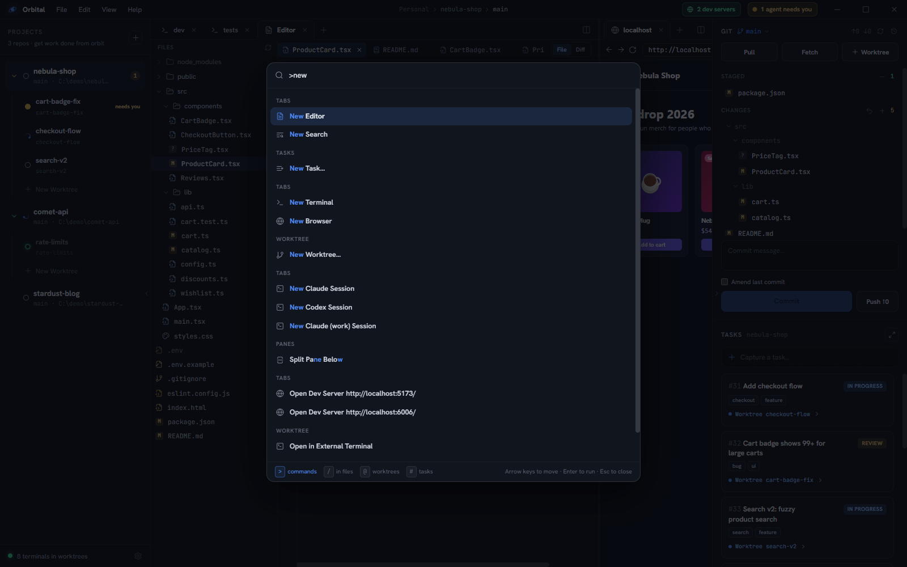
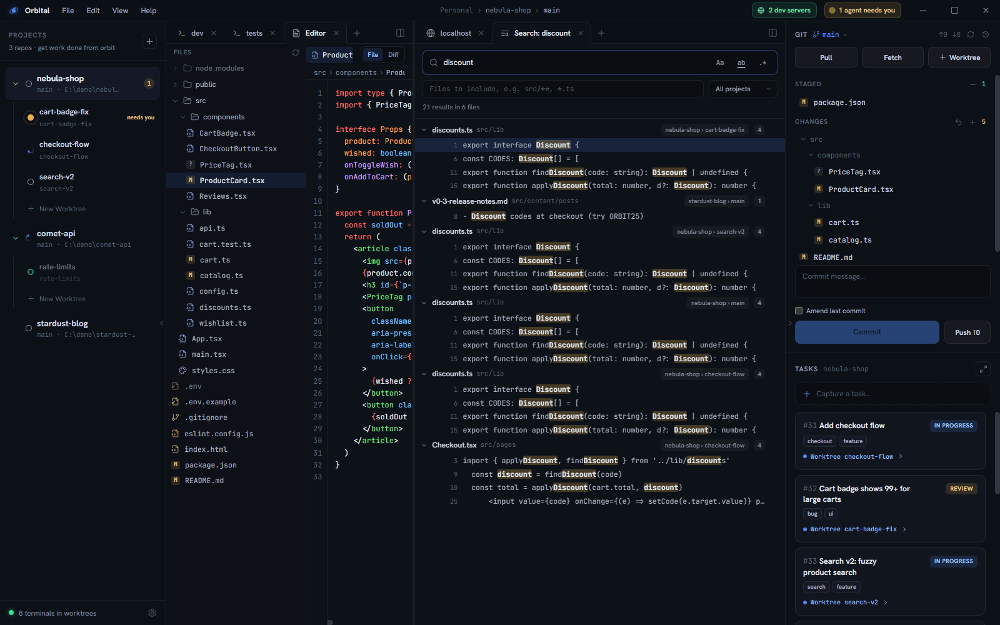

## The palette

**Ctrl+Shift+P** opens the command palette. It reaches most of what Orbital
can do: tabs, panes, git, worktrees, tasks, appearance and the app menus.



A prefix picks what you're searching:

| Type | To find |
|---|---|
| `>` | commands (what Ctrl+Shift+P starts with) |
| `/` | text inside files |
| `@` | worktrees, across every project |
| `#` | tasks, by number or title |
| nothing | a mix of file names, commands, worktrees and tasks |

**Ctrl+Shift+O** opens the mixed view. Plain **Ctrl+P** does too, but only while
focus is outside a terminal, because inside one it belongs to your shell's
history. The palette is also on **View ▸ Command Palette…** and
**View ▸ Go to File…**.

↑/↓ move through results, Home/End jump to the ends, Enter runs the selection.

Destructive git operations aren't in the palette on purpose. Three letters and
Enter should never be enough to reach Discard All.

### Files across worktrees

File-name search covers every worktree in the workspace, since running several
checkouts at once is the point. Each hit names the project and worktree it came
from, which is the only way to tell two copies of `config.ts` apart. The list
comes from git's own file list (tracked files plus untracked files that aren't
ignored) and refreshes when a checkout changes.

## The Search tab

Content search opens as a tab, not a popup, because search results are a
working set: you visit a hit, read around it, and come back for the next one.
Open one from the palette (`/` and a query, or **Search in Files…**), from a
pane's **+** menu, or from a terminal:

```sh
orbital tab new search "TODO("
```



- Toggle **Match case**, **Whole word** and **Regular expression** next to the
  query.
- **Files to include** takes globs, e.g. `src/**, *.ts`.
- The scope reaches from this worktree to the whole project or the whole
  workspace.
- Pick a hit to open the file scrolled to that line, with a brief flash. It
  opens in a pane other than the one holding the results, so the list stays in
  view.
- Strike off hits as you deal with them, with the row's control or Delete. A
  count offers them back.
- The tab keeps its query across a restart.

Search runs `git grep`, one process per checkout, over the same set of files as
file-name search. There's no index to go stale while agents rewrite files, and
a new keystroke cancels the previous search.

## Where new tabs land

Tabs opened from outside the pane area (the palette, a file in the git panel, a
dev-server link) go wherever **Settings ▸ Opening tabs ▸ Default open action**
says: the active pane, or the right, left, bottom or top pane. The default is
**Right Pane**. A worktree with a single pane gets split to make the pane you
picked.
