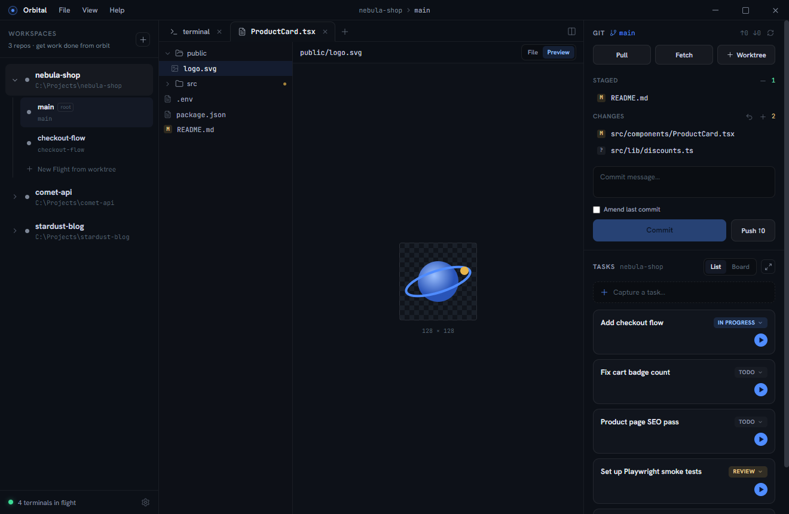

An **editor tab** shows the active worktree's files: a tree on the left, the
selected file on the right with a mode toggle in the header.

## The file tree

- Tracked and untracked files, directories first.
- Gitignored files and directories appear dimmed. A fully-ignored directory
  (`node_modules`, `dist`, …) loads its contents on first expand, so huge
  ignored trees cost nothing until you open them.
- Changed files carry their git badge (`M`, `A`, `D`, `?`, …); collapsed
  directories containing changes get an amber dot.
- The tree follows the repo live — agent edits and commits re-badge it
  automatically.

## File mode

Source renders with **syntax highlighting** (Shiki, the same engine as VS Code
grammars) across TypeScript, Python, Rust, Go, CSS, YAML, Dockerfile, and dozens
more. Very large files fall back to plain text to stay snappy.

Files are editable in place — just type. **Save** and **Cancel** light up in the
header once the buffer differs from disk; a save writes straight to the
worktree's working tree, and unsaved edits survive a peek at Diff or Preview.
It's for config tweaks and small fixes, not a replacement for your IDE.

### Find in file

**Ctrl+F** opens a find bar over the top-right of the code, seeded with whatever
you had selected. Every match is highlighted as you type and the current one is
ringed; the count reads `3 of 17`.

- **Enter** / **Shift+Enter** step forward and back, wrapping at the ends. So do
  **F3** / **Shift+F3**, which keep working while you carry on typing in the file.
- **Aa** narrows to an exact-case match.
- **Esc** closes the bar and leaves the caret on the match you stopped at.

Stepping only scrolls when the match is off screen, sideways as well as down —
a hit past the right edge of a long line is no more found than one below the fold.

### Images

Image files (`png`, `jpg`, `gif`, `webp`, `avif`, `bmp`, `ico`) render directly —
centered on a checkerboard so transparency reads, with the natural dimensions
below:



## Diff mode

Files with changes get a **Diff** toggle: unified diff with old/new line
numbers, green/red row tinting, and full syntax highlighting on the code. Files
opened from the git panel land here directly.


## Preview mode

- **Markdown** renders with theme-matched styles. Fenced code blocks tagged
  with a language (```ts, ```sh, ```rust …) get the same syntax highlighting
  as File mode, and ```mermaid fences render as diagrams in the app theme;
  a diagram that does not parse shows mermaid's error above its source.
- **HTML** renders in a sandboxed frame (no scripts, no app access — repo
  content can never reach Orbital's internals).
- **SVG** renders as an image, with the source still available in File mode.
