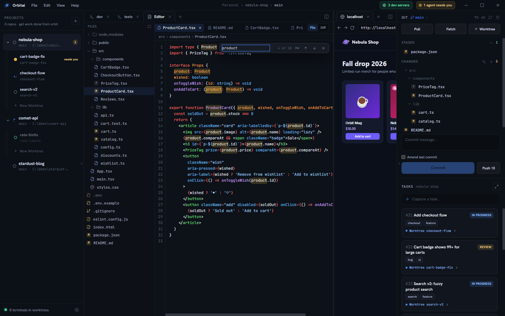
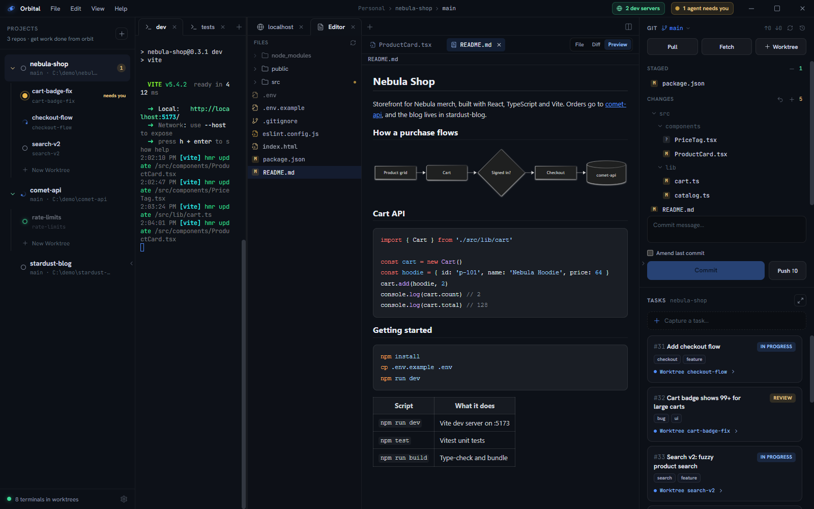

An **editor tab** shows the active worktree's files: a tree on the left, and on
the right a strip of open-file pills above the selected file.



## Open files

Each file you open gets a **pill**, and each pill keeps its own buffer, unsaved
edits and view mode. A breadcrumb under the strip shows the active file's path.
An edited file shows a dot where its close button would be (hover to get the X
back). Closing it asks whether to save, discard or cancel.

Files from the git panel, the command palette and search results open as pills
in the editor you're already using, instead of a new tab each.

## The file tree

- Tracked and untracked files, directories first. Each file has an icon for
  its kind (code, config, lockfile, media, archive), tinted by language in the
  current theme's colours.
- Gitignored files and directories appear dimmed. A fully-ignored directory
  (`node_modules`, `dist`, …) loads its contents on first expand, so huge
  ignored trees cost nothing until you open them.
- Changed files carry their git badge (`M`, `A`, `D`, `?`, …); collapsed
  directories containing changes get an amber dot.
- The tree follows the repo live — agent edits and commits re-badge it
  automatically.
- Right-click a row for **New File…**, **New Folder…**, **Rename…**, **Copy
  Path**, **Copy Relative Path**, **Reveal in File Explorer**, open with the
  default app, **Open in Terminal** (folders), git stage / unstage / discard,
  and **Delete** (to the recycle bin). Names are typed right in the menu, and
  names Windows can't represent (`CON`, a trailing dot, `:`) are refused.

## File mode

Source renders with **syntax highlighting** (Shiki, the same engine as VS Code
grammars) across TypeScript, Python, Rust, Go, CSS, YAML, Dockerfile, and dozens
more. Very large files fall back to plain text to stay snappy.

A line-number gutter stays aligned as you scroll, and Tab indents. Files are
editable in place — just type, then **Ctrl+S** to save straight to the
worktree's working tree. Unsaved edits survive a peek at Diff or Preview and a
switch to another pill. Right-click the text for Undo, Redo, Cut, Copy, Paste
and Select All. It's for config tweaks and small fixes, not a replacement for
your IDE.

Oversized files and diffs are refused up front with a message saying why,
rather than freezing the tab.

### Find in file

**Ctrl+F** opens a find bar over the top-right of the code, seeded with whatever
you had selected. Every match is highlighted as you type and the current one is
ringed; the count reads `3 of 17`.

- **Enter** / **Shift+Enter** step forward and back, wrapping at the ends. So do
  **F3** / **Shift+F3**, which keep working while you carry on typing in the file.
- **Aa** narrows to an exact-case match.
- **Esc** closes the bar and leaves the caret on the match you stopped at.

Stepping only scrolls when the match is off screen, sideways as well as down —
a hit past the right edge of a long line is no more found than one below the fold.

### Images

Image files (`png`, `jpg`, `gif`, `webp`, `avif`, `bmp`, `ico`) render directly —
centered on a checkerboard so transparency reads, with the natural dimensions
below.

## Diff mode

Files with changes get a **Diff** toggle: unified diff with old/new line
numbers, green/red row tinting, and full syntax highlighting on the code. Files
opened from the git panel land here directly.


## Preview mode



- **Markdown** renders with theme-matched styles, including local images.
  Links open in an in-app browser tab; Ctrl+click opens your system browser. Fenced code blocks tagged
  with a language (```ts, ```sh, ```rust …) get the same syntax highlighting
  as File mode, and ```mermaid fences render as diagrams in the app theme;
  a diagram that does not parse shows mermaid's error above its source.
- **HTML** renders in a sandboxed frame (no scripts, no app access — repo
  content can never reach Orbital's internals).
- **SVG** renders as an image, with the source still available in File mode.
