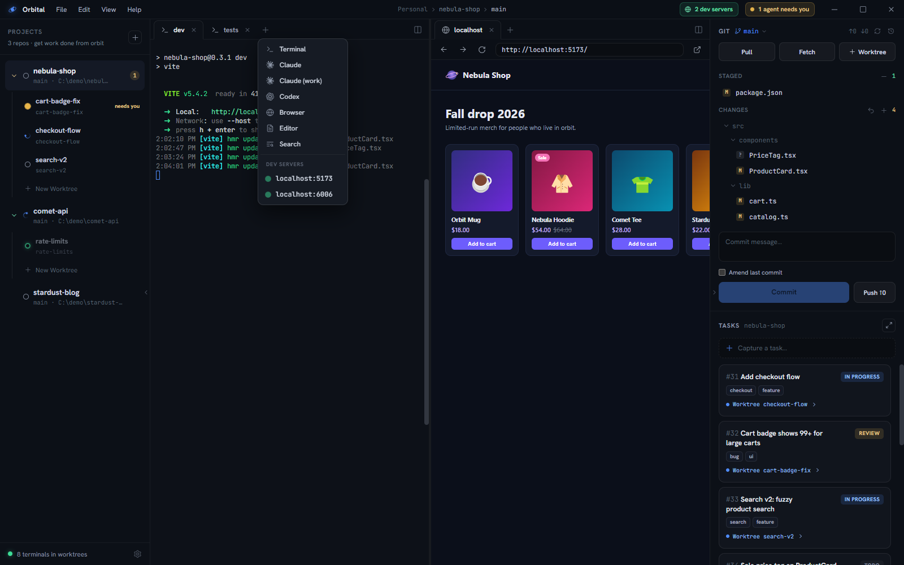

## Two ways to run an agent

1. **In a plain terminal.** Every Flight terminal is a real shell — run `claude`
   (or any agent CLI) like you always do.
2. **As an agent tab.** Click **+** in a tab strip and pick **Claude**. The tab
   boots directly into the agent, shows a status dot instead of an icon, and
   cleans itself up when the session ends.

Per workspace you can configure which provider agent tabs launch and an explicit
executable path (Settings), for setups where the agent isn't on `PATH`.
**Claude Code is the fully supported harness at launch; Codex support is
planned.**

Either way, Orbital runs the *real* interactive CLI — not an API wrapper — so
every feature of your harness works exactly as it does in a standalone
terminal: slash commands, hooks, MCP servers, permission modes, plan mode, and
your subscription's pricing rather than metered tokens.

## The briefing

Agent tabs launch with a short generated briefing: which workspace/Flight/branch
the agent is in, and how to use the `orbital` CLI — filing tasks, progressing
the task board, and registering dev servers. The briefing lives in Orbital's own
app-data folder, never in your repo.

## Claude Code status hooks

The hooks are what make statuses effortless. In **Settings → Claude status
hooks**:

- **Preview** shows the exact JSON Orbital will merge into
  `~/.claude/settings.json` before anything is written.
- **Install** merges just those entries (idempotent); **Remove** strips exactly
  them and nothing else.
- The hook script guards on Orbital's environment variables, so Claude sessions
  started *outside* Orbital are completely unaffected.

Once installed, every Claude session inside Orbital reports: *working* on each
tool use, *needs-attention* on permission and idle prompts, *idle* on stop,
*error* on failures, *done* on session end.

## Working the fleet

A rhythm that works well:

- Keep **3–5 Flights** active: enough parallelism to keep you busy purely with
  decisions and reviews, few enough that a chime always means something.
- Do your own work in the **root Flight** while worktree Flights grind.
- When an agent finishes, review its diff in the git panel *in that Flight* —
  the working directory is already correct.
- Have agents file follow-ups with `orbital task add` instead of expanding scope.
