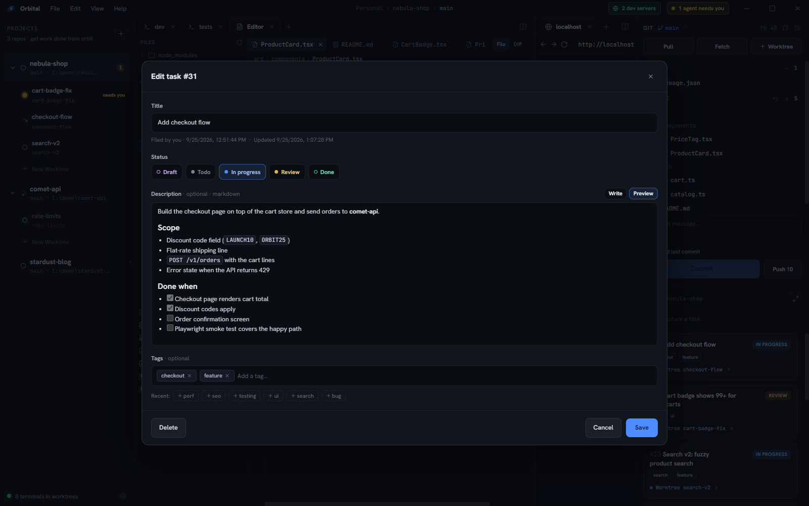
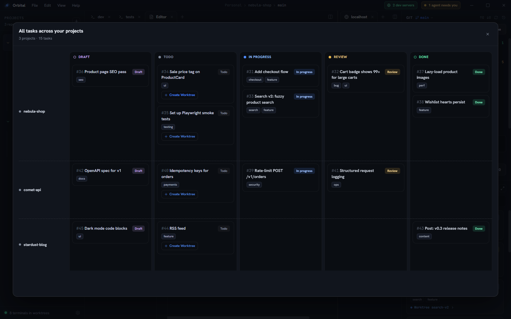

Each project has a lightweight task tracker in the right panel — designed for
capture speed, not ceremony.

## Capturing and editing

- Type into **Capture a task…** and press Enter.
- Click a title to edit it inline.
- Click the status chip to move it through
  `draft → todo → in progress → ready for review → done`.
- Hover a card and click the trash icon to delete (with an inline confirm).

## Board views

Toggle **List / Board** for a per-project kanban:



The expand button opens the **full board** — every project as a swim-lane,
with drag-and-drop between status columns *and* between projects:



## From task to worktree

Press the ▶ button on any unlinked task to open **New Worktree** pre-filled and
pre-linked: the branch name comes from the task title, and once created the task
shows a link to its worktree. Finish the work, mark the task done, delete the
worktree — the full loop lives in one panel.

## Tasks for agents

Agents see the same board through the `orbital` CLI:

```sh
orbital task add "Fix cart badge count" --description "Badge shows items, not quantity"
orbital task list
# ID        STATUS       TITLE
# f907b669  in_progress  Add checkout flow
# cfff155f  todo         Fix cart badge count
orbital task update f907 --status ready-for-review
orbital task done cfff
```

IDs accept unique prefixes, so agents can pipe `task list` output straight back
into `task update`. A well-briefed agent files discovered work instead of
drifting scope, and marks its own task ready for review when it stops.
