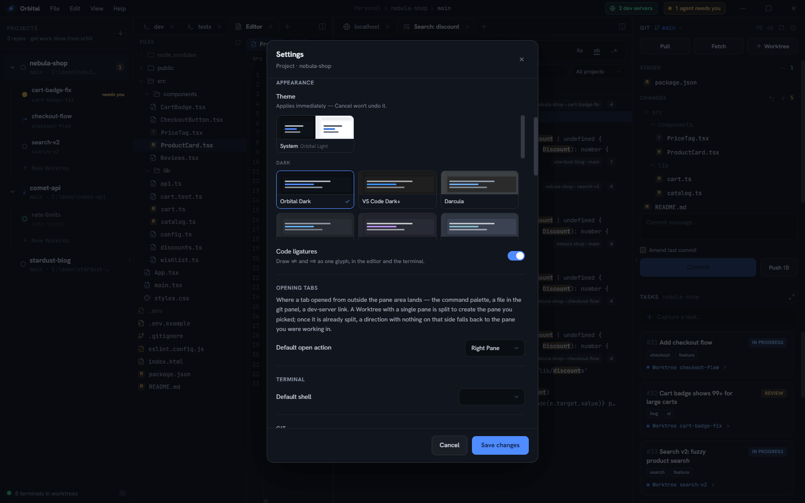
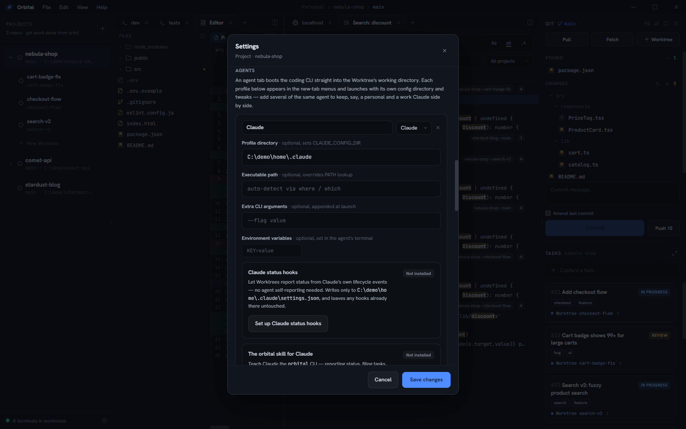

Open Settings from **File ▸ Settings…**, the gear at the bottom of the left
rail, or the command palette.

Every setting belongs to the **workspace** whose window you opened it in.
Nothing is machine-wide, so a Work window and a Personal window can differ in
everything from theme to shell. A workspace that never set a value falls back
to what older builds stored globally. See [Workspaces](/orbital/concepts/workspaces/).

Most changes wait for **Save changes**. The theme, the accent and code
ligatures apply the moment you click them, so Cancel won't undo those.

## Workspace

- **Name** is shown in the title bar and the workspace picker.
- **Accent color** tints this workspace's window: eight presets, a custom
  colour, or a hex value. Orbital adjusts it as far as the current theme needs
  to keep it readable. **Default** uses the theme's accent.

## Environment file sync

Glob patterns for untracked files to copy from the root checkout into a new
worktree. The defaults cover `.env` and `.env.*` files at any depth plus agent
config directories (`.claude/**`, `.codex/**`, `.cursor/**` and friends), and `node_modules/**`,
which copies in the background so a new worktree doesn't need an install. Add
patterns like `**/.dev.vars` for whatever else your tooling keeps out of git.

The copy happens once, at creation. After that a worktree's files are its own.
To copy again, use **Sync env files from root** on the worktree's right-click
menu, or run `orbital worktree sync` in one of its terminals. Both overwrite the
worktree's copies.

## Appearance

- **Theme** shows the gallery of twenty themes plus **System**, which follows
  the OS with a dark theme and a light theme of your choice.
- **Code ligatures** turns JetBrains Mono's joined glyphs (`=>`, `!=`) on or
  off in the editor, diffs and terminal.

More on both in [Themes & appearance](/orbital/guides/appearance/).

## Opening tabs

**Default open action** decides where a tab opened from outside the pane area
lands: the command palette, a file in the git panel, a dev-server link. Choose
**Active Pane**, **Right Pane** (the default), **Left Pane**, **Bottom Pane** or
**Top Pane**. A worktree with a single pane is split to create the pane you
picked. Once it's split, a direction with nothing on that side falls back to
the pane you were working in.

## Terminal

**Default shell** is what new terminals run. PowerShell is the default; `pwsh`,
`cmd`, Git Bash or a WSL launcher work too.

## Git

**Periodic fetch** fetches each repo in the background so ahead/behind counts
stay current. On by default.

## Agents

A list of **agent profiles**. Each profile shows up in the new-tab menus and
launches its CLI with its own settings:

- **Name**, as it appears in menus and to `orbital tab new agent <name>`
- **CLI**: Claude, Codex or Cursor
- **Profile directory** (optional), exported as `CLAUDE_CONFIG_DIR`,
  `CODEX_HOME` or `CURSOR_CONFIG_DIR`. `~`, `%VAR%` and `$VAR` are expanded,
  and Settings shows what the path resolves to and warns if no directory is
  there yet.
- **Executable path**, **extra arguments** and **environment variables**

Add as many as you like, including several of one CLI. A personal Claude and a
work Claude, each pointed at its own profile directory, can sit side by side.

Each profile's card also carries the installs for that profile:
[Claude status hooks](/orbital/agents/integration/#claude-status-hooks),
[the orbital skill](/orbital/agents/skill/), and, for Codex,
[the AGENTS.md instructions](/orbital/agents/integration/#codex-instructions).
Every one has **Preview**, **Install** and **Remove**, and **Update** when a new
Orbital release changes what it would write. Save a new or edited profile
before installing; the installs write into the saved profile directory.

Below the profiles are two per-**project** settings for the project you're on:

- **Default agent** is the profile an agent tab boots when you don't pick one.
- **Executable path** overrides the profile's own path for this project only.

## Debug logging

Records CLI calls, UI actions and errors to a rotating log file. Useful when
reporting a crash. **Open log folder** takes you to the files.

## Needs-attention alerts

| Setting | Effect |
|---|---|
| Global indicator | The title-bar banner when any worktree needs you |
| Sound | A chime on a *new* needs-attention |
| Taskbar badge | The taskbar icon's satellite glows amber |
| Taskbar flash | The taskbar button flashes while Orbital is in the background |
